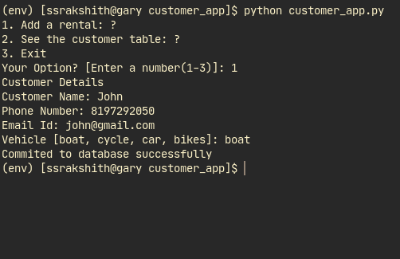
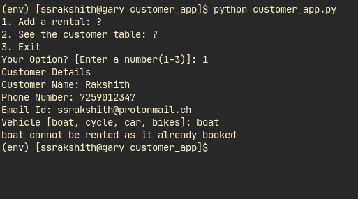
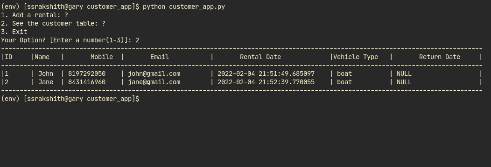

# Managing Vehicle Rentals

A console app to manage rental details of vehicles in the inventory

## Adding Details to the database



## Check If the vehicle is already booked out



## Viewing the Customer Table



## To Run this app

Install phonenumbers module via pip, in the terminal or command line

```
pip install phonenumbers
```

Then run the customer_app.py file

```
python customer_app.py
```

